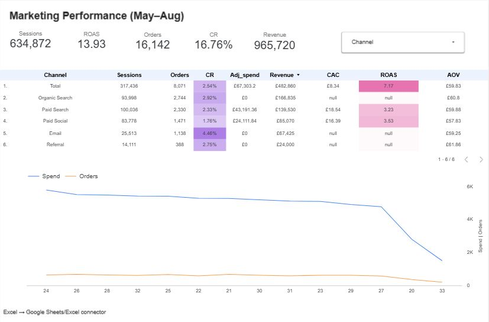

# Marketing Performance Dashboard (Looker Studio)

**Live report:** https://lookerstudio.google.com/reporting/43590b7d-a4f7-4998-b7bd-8bf3ebc317a6

---

## Introduction
A single-page **Looker Studio** dashboard built from an Excel dataset to **analyse May–Aug performance by channel**.  
The report surfaces headline KPIs (Sessions, Orders, **Conversion Rate**, **Revenue**, **ROAS**) alongside a by-channel view and a weekly **Spend vs Orders** trend.  
It uses a Channel filter and **calculated, weighted metrics** so totals remain correct at any level of aggregation.

---

## Data
**Source:** Excel workbook connected directly to Looker Studio  
**Tabs used:** `channel_summary` (channel performance), `weekly_summary` (ISO week trend)

**Key fields**
- `Channel`, `Sessions`, `Clicks`, `Adj_spend` (£), `Orders`, `Revenue` (£)
- Helper columns: `CR`, `AOV`, `CAC`, `ROAS` (re-created as calculated fields for robustness)

**Calculated fields (weighted in Looker Studio)**
- `Conversion Rate = SUM(Orders) / SUM(Sessions)`
- `AOV = SUM(Revenue) / SUM(Orders)` *(£ per order)*
- `CAC = SUM(Adj_spend) / SUM(Orders)` *(£ per order)*
- `ROAS = SUM(Revenue) / SUM(Adj_spend)`

---

## Dashboard Overview
**Controls**
- **Channel** drop-down filter (top-right)

**KPI scorecards (top row)**
- **Sessions**, **ROAS**, **Orders**, **Conversion Rate**, **Revenue (£)**

**By-channel table (centre)**
- *Channel | Sessions | Orders | CR | Adj_spend (£) | Revenue (£) | CAC (£) | ROAS | AOV (£)*  
- Sorted by **Revenue** (desc). Heatmap on **CR/ROAS** for quick scanning.

**Weekly trend (bottom)**
- **Spend (£)** and **Orders** across ISO weeks (dual axis, data markers enabled).  
- Note: final week may be **partial**, so end-of-period dips are expected.

---

## How to Use
1. Open the live report and use the **Channel** filter to focus on specific acquisition channels.
2. Read the **KPI cards** for the headline picture.
3. Drill into the **by-channel table** to compare efficiency (CAC/AOV/ROAS) and conversion.
4. Scan the **weekly trend** to see how spend and demand move together; watch for seasonality or partial-week effects.

---

## Conclusion
- The dashboard provides a **clear, audit-able view** of channel performance and weekly pacing, suitable for marketing **optimisation** and budgeting conversations.  
- **Weighted KPIs** ensure accuracy at both total and segmented levels, avoiding average-of-averages pitfalls.  
- Stakeholders can quickly pinpoint **efficient channels** (high ROAS/CR, sensible CAC) and identify **weeks with unusual movement** to investigate (e.g., late-period drops that may be partial weeks).  

---

## What I Built / Skills Demonstrated
- **Looker Studio (Data Studio):** connectors, calculated fields, table + time-series visuals, filters/controls, theming.
- **Marketing analytics:** CR, AOV, CAC, ROAS, RPV; channel comparison and weekly pacing.
- **Data handling:** Excel → Looker Studio connector; correct typing (GBP/Percent); **weighted** calculations for reliable totals.
- **Publishing & sharing:** view-only link suitable for stakeholders and portfolio reviewers.
